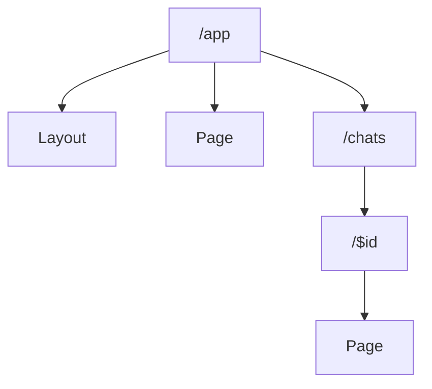
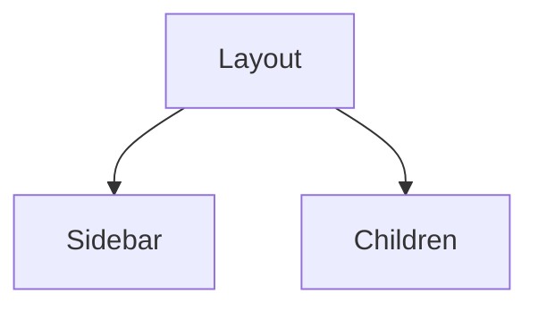
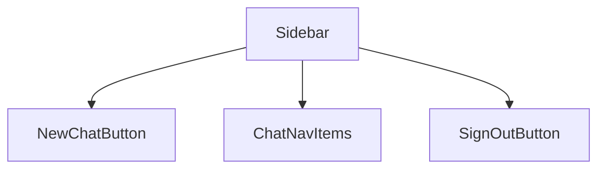

# Routes, Layouts and Pages

```mermaid
graph TD
  A[ /app] --> B[Layout]
  A --> D[Page]
  A --> E[ /chats]
  E --> F[ /$id ]
  F --> G[Page]
```
 
 

# /app Layout

```mermaid
graph TD
  A[Layout] --> B[Sidebar]
  A --> D[Children]
```
 
 

# Sidebar component dependencies

```mermaid
graph TD
  A[Sidebar] --> B[NewChatButton]
  A --> D[ChatNavItems]
  A --> E[SignOutButton]
```